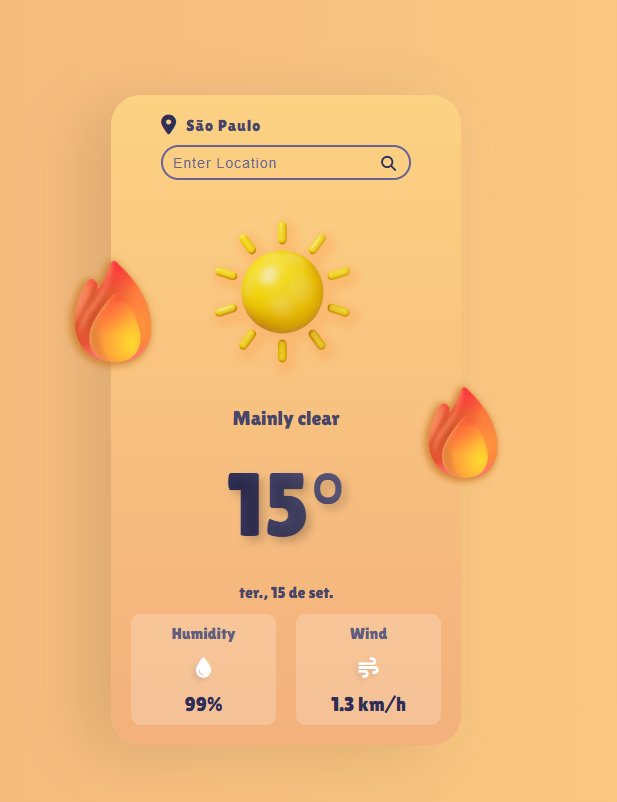
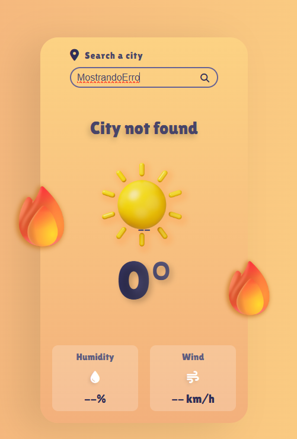

<p align="center">
  
</p>

<h1 align="center">LiveWeatherApp</h1>

Projeto universitário desenvolvido em **React + JavaScript** com o objetivo de praticar o consumo de APIs REST no front-end. A aplicação permite pesquisar uma cidade e exibir a previsão do tempo atual, usando geocodificação para converter o nome da cidade em coordenadas e, em seguida, buscar os dados climáticos correspondentes.

## Screenshots

| Resultado da busca | Carregando | Cidade não encontrada |
| --- | --- | --- |
|  |  |  |

## Funcionalidades

- Busca de clima por nome de cidade (via clique no ícone de lupa ou tecla Enter)
- Exibição de temperatura, umidade, velocidade do vento e descrição do clima
- Ícone dinâmico de acordo com a condição climática (ensolarado, nublado, chuvoso, nevando)
- Data formatada em português (`pt-BR`)
- Estado de carregamento (loading) durante a requisição
- Tratamento de erros: cidade não encontrada e falhas na requisição
- Campo de busca controlado, com limpeza automática após uma pesquisa bem-sucedida

## Tecnologias

- [React](https://react.dev/) 19
- [Vite](https://vitejs.dev/) 8
- JavaScript (ES2020+)
- [Open-Meteo API](https://open-meteo.com/) (Geocoding API + Forecast API)
- Font Awesome (ícones)

## Arquitetura do projeto

O projeto segue uma arquitetura modular, separando responsabilidades entre componentes de apresentação, serviços de API e utilitários:

```
src/
├── assets/
│   └── images/          # Ícones de clima e gif de loading
│
├── components/
│   ├── SearchBar.jsx      # Campo de busca e cidade atual
│   ├── WeatherCard.jsx    # Ícone, descrição e temperatura
│   ├── WeatherDetails.jsx # Umidade e vento
│   ├── WheatherApp.jsx    # Estado, handlers e orquestração da busca
│   └── WheatherApp.css
│
├── services/
│   └── weatherService.js  # Comunicação com a API Open-Meteo
│
├── utils/
│   ├── formatDate.js      # Formatação de data em pt-BR
│   └── weatherCode.js     # Mapeamento dos códigos WMO para ícone/descrição
│
├── App.jsx
└── main.jsx
```

## Como executar

Pré-requisitos: [Node.js](https://nodejs.org/) instalado.

```bash
# instalar as dependências
npm install

# rodar em modo desenvolvimento
npm run dev

# gerar build de produção
npm run build

# pré-visualizar o build de produção
npm run preview

# rodar o lint
npm run lint
```

Após rodar `npm run dev`, acesse o endereço exibido no terminal (por padrão `http://localhost:5173`).

## API utilizada

A aplicação consome dois endpoints públicos da [Open-Meteo](https://open-meteo.com/), sem necessidade de chave de API:

- **Geocoding API** (`https://geocoding-api.open-meteo.com/v1/search`): converte o nome da cidade digitada em latitude/longitude, nome oficial e país.
- **Forecast API** (`https://api.open-meteo.com/v1/forecast`): retorna os dados climáticos atuais (temperatura, umidade, velocidade do vento e código do clima) para as coordenadas obtidas.
